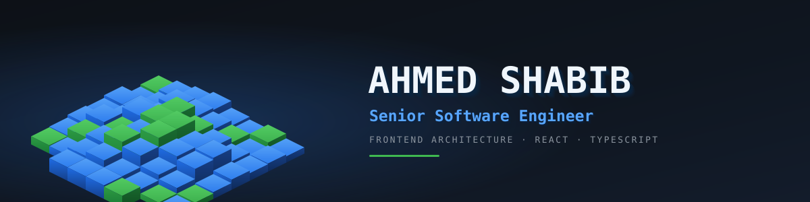
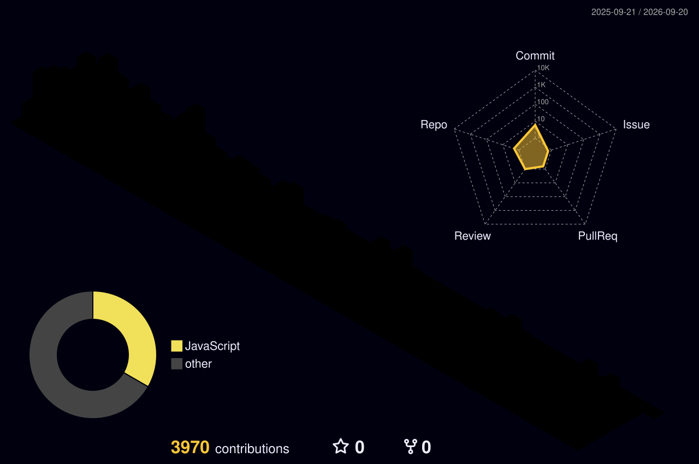

  

---

## 👋 About

Frontend-leaning full-stack engineer, 4 years at **Dubizzle Labs** in Lahore. I build large-scale marketplace and CRM products — the kind with thousands of concurrent users, data-heavy tables, and a long maintenance tail.

I lead a team of 5 and spend most of my time on **architecture decisions that age well**: state management that doesn't collapse at scale, component systems teams actually reuse, and render paths that stay fast when the data doesn't cooperate.

> **4,200+ contributions last year — most in private repos.** This profile is the trailer, not the film.

---

## 🧱 What I've built

<table>
<tr><td width="100%" valign="top">

### 📱 PropOne Consumer App
`React Native` · `Multi-tenant`

Mobile app for a property booking & facility management platform. **One codebase, three shells** that swap at runtime based on who logs in:

&nbsp;&nbsp; &nbsp;Residents — visitor entry, service tickets, unit bills, delegated access 
&nbsp;&nbsp; &nbsp;Buyers — installment ledgers and payment history per booking 
&nbsp;&nbsp; &nbsp;Portfolio dashboard — received/billed/overdue financials, aging charts

Role-driven navigators over shared module code — three products to maintain, one app to ship.

</td></tr>
</table>

<table>
<tr><td width="50%" valign="top">

### 🏢 Dubizzle CRM
`Multi-tenant` · `ReactJS`

In-house multi-tenant application serving multiple business units.

Migrated to **Redux Toolkit + RTK Query**, streamlining data fetching. Automated CI/CD pipelines, cutting deployment errors and cycle time.

</td><td width="50%" valign="top">

### 📊 Jarvis CRM
`Internal` · `React`

Sales CRM with real-time dashboards and data visualization driving day-to-day decisions.

Built task-tracking modules with advanced state management; proposed and shipped architectural refinements for scalability.

</td></tr>
</table>

<table>
<tr><td width="100%" valign="top">

### 🛒 Seller Center
`OLX` · `React` · `TypeScript`

Product management platform for online sellers — inventory, listings, and customers at thousands-of-sellers scale.

Designed the frontend architecture in **React + Redux Toolkit + TypeScript**. The 30% came from caching, pagination, and cutting distributed API calls; the 25% from a modular component system teams actually reused.

</td></tr>
</table>

---

## ⚙️ Stack

**Core**

**APIs & Data**

**Cloud, DevOps & Testing**

---

## 🧊 Contributions, in three dimensions

  

---

## 🎲 Side projects

- **[Portfolio](https://portfolio-ahmed-shabib.vercel.app/)** `Next.js · Vercel` — my work, live · [source](https://github.com/AhmedShabib02/portfolio)
- **Chess Engine** `Python` — MiniMax with alpha-beta pruning
- **Linux Shell** `C` — a shell sitting between user and kernel

---

🎓 **BS Computer Science, FAST NUCES** · Islamabad, 2018–2022

 

**Open to senior frontend and full-stack roles.**

See the full picture → **[portfolio-ahmed-shabib.vercel.app](https://portfolio-ahmed-shabib.vercel.app/)**

